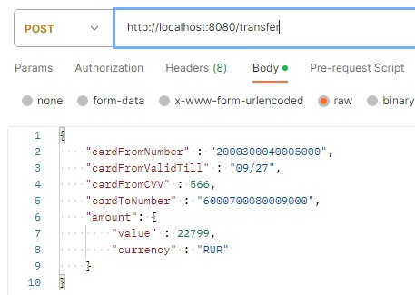
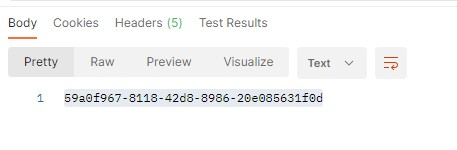
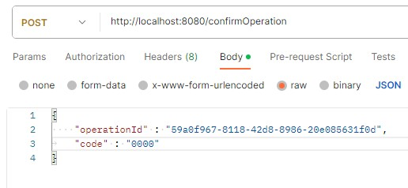
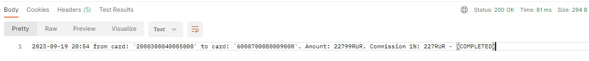

# Курсовой проект "Сервис перевода денег"

Разработанное приложение представляет собой REST-сервис для перевода денег. 

Заранее подготовленное веб-приложение (FRONT) подключается к разработанному сервису без доработок и использует его функционал.

# Краткая характеристика приложения
- RRESTfull API;
- Использован Spring Boot;
- Использован сборщик пакетов Maven;
- Для запуска используется Docker Compose;
- Код покрыт юнит-тестами с использованием Mockito;
- В проекете имеются интеграционные тесты с использованием TestContainers;
- Многопоточность. Приложение способно ожидать подтверждения транзакции от нескольких запросов, т.к. для каждой операции перевода выделяется отдельный поток;
- Хранение информации о картах и операциях перевода реализовано с помощью потокобезопасной `ConcurrentHashMap`;
- Настройки Docker хранятся в корне проекта в файле `Dockerfile`;
- Настройки Docker Compose хранятся в корне проекта в файле `docker-compose.yaml`.

# Запуск приложения

Запуск осуществляется на порту `8080` через терминал с помощью образа Docker и его команды:
`docker run -itd --name courseapp -p 8080:8080 courseapp:latest`

# Пример запроса

Для тестирования приложения использовалась ПО Postman.

Отправим валидный запрос нашему приложению:
```
{
    "cardFromNumber" : "2000300040005000",
    "cardFromValidTill" : "09/27",
    "cardFromCVV" : 566,
    "cardToNumber" : "6000700080009000",
    "amount": {
        "value" : 22799,
        "currency" : "RUR"
    }
}
```

Адрес запроса: http://localhost:8080/transfer



Ответ приходит в ввиде UUID:



Формируем подтверждающий операцию перевода запрос, имитируя ввод пришедшего на смартфон кода (для упрощения - всегда равен `0000`) в комбинации с полученным ранее UUID:

```
{
    "operationId" : "59a0f967-8118-42d8-8986-20e085631f0d",
	"code" : "0000"
}
```



В ответе видим полную информацию о транзакции и её статус - `COMPLETED`:



**ПРИМЕЧАНИЕ:** На ввод кода подтверждение даётся 60 секунд. Если не успеть, то поток, обрабатывающий её, заканчивает свою работу а транзакция считается невыполненной.

# Логирование

  Логирование операций осуществляется напрямую в файл `logs.txt`, хранящийся в корне проекта.